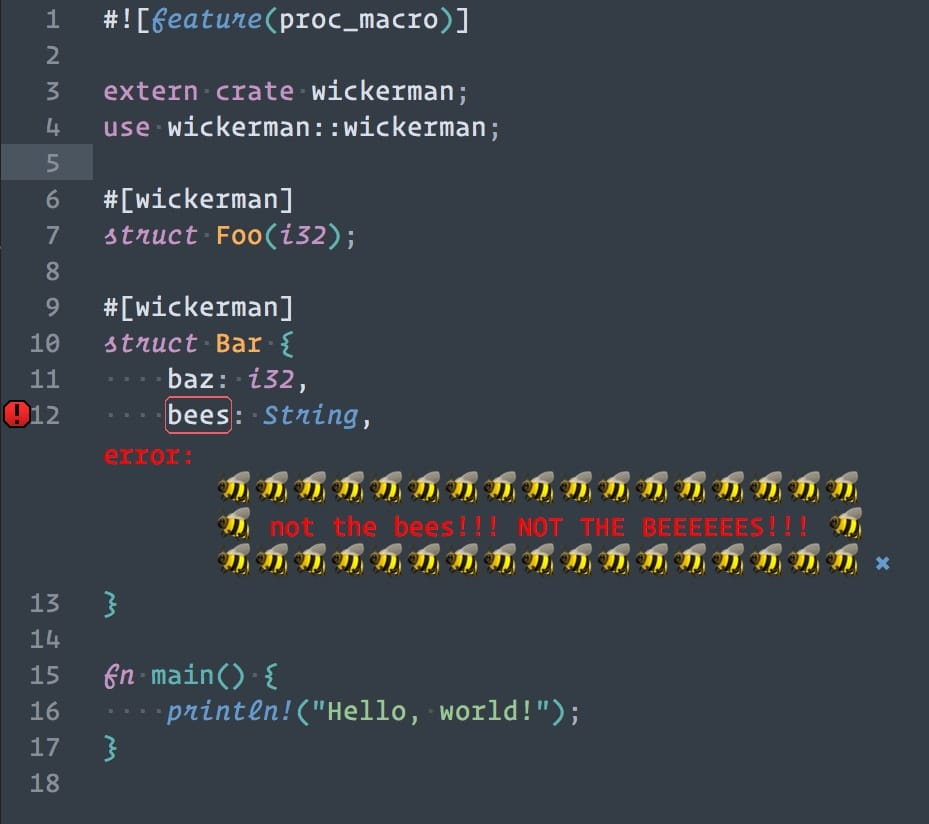
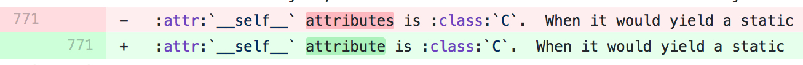

footer: Zach Mitchell -- tinkering.xyz

# Abusing Type Annotations

## Zach Mitchell
## tinkering.xyz

[.footer: ]

---

# Rust is *really* nice

- Fast
- Useful type system
- Memory safe

but my favorite feature is...

---

# Rust Procedural Macros

`Code -> AST -> [Your Macro Here] -> New AST`

Great for:
- Code generation
- Reducing boilerplate
- Custom syntaxes or shorthands
- etc.

---

# Rust Procedural Macros

Generate CLI parsing code by defining a struct

```rust
#[derive(StructOpt, Debug)]
#[structopt(name = "basic")]
struct Opt {
    // Enable debug mode
    #[structopt(short = "d", long = "debug")]
    debug: bool,

    // Set verbosity
    #[structopt(short = "v", long = "verbose", parse(from_occurrences))]
    verbose: u8,

    // Output file
    #[structopt(short = "o", long = "output", parse(from_os_str))]
    output: PathBuf,
}
```

---

# Rust Procedural Macros

...or do something slightly less useful

### `tinkering.xyz/introduction-to-proc-macros`



---

# Can I Do This In Python?

---

# Can I Do This In Python?

- Decorators get you half-way there
- The `ast` module lets you do more
- But how do I attach things to variables?


---

# Type Annotations

```python
class MyClass:
    foo: SomeRealType
    bar: "this can be anything"
```

Type? No!
That's an arbitrary string attached to your variable!

---

# Great Learning Experience!

- Diving into the data model
- Learning about descriptors
- Abstract syntax trees
- 🤓

---

# First CPython Contribution!



---

# Ex.) Generate Properties

```python
@inrange
class MyClass:
    foo: "0 < foo < 3"  # <- generates a property
    bar: int  # <- normal class variable
```

Each **_instance_** gets a property that only accepts values in the specified range

---

# Ex.) Notify On Write

```python
@notify
class MyClass:
    def __init__(self, x):
        self.x: "this one" = x  # will be notified
        self.y = True  # won't be notified
```

Notifies the user when `MyClass.x` is set

---

# Live Demo!

