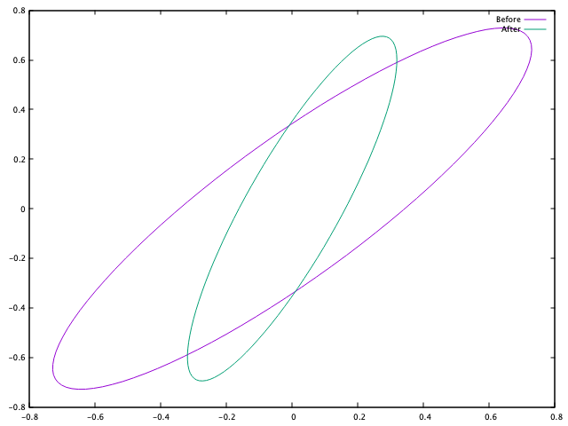

slidenumbers: true
slidecount: true
footer: Zach Mitchell

# Polsim
### A case study for scientific computing in Rust

Zach Mitchell

[.hide-footer]

---

# polsim

## CLI tool for *pol*arization *sim*ulations

---

# Project structure

- `polarization`
    - Crate I wrote for the polarization simulations
    - Uses a technique called Jones calculus
- `polsim`
    - Provides a CLI for `polarization`

---


[.background-color: #ffffff]

^ The polarization is defined as how the light oscillates perpendicular to the direction that it's traveling.

^ You can see that the polarization changes from one form to another as it passes through these elements.

^ What we want to do is predict how our beam is going to look after interacting with several of these elements.

^ We can also use this to say "this is how my polarization looks, what could make it look this way?"

^ We use a technique called Jones calculus to model these interactions.

---

# Jones calculus primer

Polarization is a vector with two components:

^ A vector is basically a matrix with one column.

$$
\vec{E} = \begin{bmatrix} A \\ B e^{i\delta} \end{bmatrix} = \begin{bmatrix} \text{complex number} \\ \text{complex number} \end{bmatrix}
$$

Optical elements that interact with the beam are 2x2 matrices:

$$
M = \begin{bmatrix}
m_{00} & m_{01} \\
m_{10} & m_{11}
\end{bmatrix} = \begin{bmatrix}
\text{complex} & \text{complex} \\
\text{complex} & \text{complex}
\end{bmatrix}
$$

---

# Jones calculus primer

Multiply initial polarization by the optical elements to get the final polarization

$$
E_{f} = M_{N} \times \ldots \times M_2 \times M_1 \times E_i
$$

When you get down to it, you're just multiplying 2x2 matrices.

^ You start with your initial beam on the right.

^ You encounter the matrices of your optical elements in order as you travel left to right.

^ You end up with the final beam on the left.

^ In principle you could do all of this by hand, and some people do.

---

# Those matrices can be pretty ugly...

$$
\begin{bmatrix}
\cos^{2}\left(\theta\right) + e^{i\varphi} \sin^{2}\left(\theta\right) & \sin\left(\theta\right)\cos\left(\theta\right) - e^{i\varphi} \sin\left(\theta\right)\cos\left(\theta\right) \\\\
\sin\left(\theta\right)\cos\left(\theta\right) - e^{i\varphi} \sin\left(\theta\right)\cos\left(\theta\right) & \sin^{2}\left(\theta\right) + e^{i\varphi} \cos^{2}\left(\theta\right) \\\\
\end{bmatrix}
$$

No one has ever used this matrix without looking it up

^ The goal with polsim is to lower the barrier of entry for doing these simulations.

---

# Translation to Rust

- Complex numbers
    - `num::complex::Complex<T>`
- Vectors
    - `nalgebra::Vector2<T>`
- Matrices
    - `nalgebra::Matrix2<T>`

^ num::complex is the most mature, full-featured option for complex numbers at the moment.

^ Lots of options for linear algebra libraries (nalgebra, ndarray, vecmath, cgmath, etc).

^ Many crates are tailored towards graphics/games.

^ ndarray is Rust's current analog of NumPy, but nalgebra is more targeted at the kinds of matrix operations I'm doing.

---

# Struggle #1 - debugging

[.code-highlight: 1]
[.code-highlight: 2-5]
[.code-highlight: 4]

```
(lldb) br set -f system.rs -l 348
Breakpoint 1: where = polarization-b20b1f754e235950`polarization
::jones::system::OpticalSystem::composed_elements
::_$u7b$$u7b$closure$u7d$$u7d$
::h19d2e65336af7615 + 577 at system.rs:348:30, address = 0x00000001001e8c11
```

---

# Struggle #2 - debugging nalgebra

[.code-highlight: all]
[.code-highlight: 5-7]

```
Process 33329 stopped
* thread #2, name = 'jones::system::test::test_beam_passes_through', stop reason = breakpoint 1.1
    frame #0: 0x00000001001e8c11 polarization-b20b1f754e235950`polarization::jones::system::OpticalSystem
    ::composed_elements::_$u7b$$u7b$closure$u7d$$u7d$::h19d2e65336af7615((null)=0x000070000ef72f98,
    acc=Matrix<num_complex::Complex<f64>, nalgebra::base::dimension::U2, nalgebra::base::dimension::U2,
    nalgebra::base::matrix_array::MatrixArray<num_complex::Complex<f64>, nalgebra::base::dimension::U2,
    nalgebra::base::dimension::U2>> @ 0x000070000ef73030, elem=0x0000000100c16aa0) at system.rs:348:30
```

Half of this debug message is just about the type of the matrix!

---

# Struggle #2 - debugging nalgebra

```
(lldb) fr v
(closure *)  = 0x000070000ef72f98
(nalgebra::base::matrix::Matrix<num_complex::Complex<double>, nalgebra::base::dimension::U2,
nalgebra::base::dimension::U2, nalgebra::base::matrix_array::MatrixArray<num_complex::Complex<double>,
nalgebra::base::dimension::U2, nalgebra::base::dimension::U2> >) acc = {
  data = {
    data = {
      data = {
        parent1 = {
          parent1 = {
            parent1 = <Unable to determine byte size.>

            parent2 = <Unable to determine byte size.>

            data = (re = 1, im = 0)
          }
          parent2 = {
            parent1 = <Unable to determine byte size.>

            parent2 = <Unable to determine byte size.>

            data = (re = 0, im = 0)
          }
          _marker = {}
        }
        parent2 = {
          parent1 = {
            parent1 = <Unable to determine byte size.>

            parent2 = <Unable to determine byte size.>

            data = (re = 0, im = 0)
          }
          parent2 = {
            parent1 = <Unable to determine byte size.>

            parent2 = <Unable to determine byte size.>

            data = (re = 1, im = 0)
          }
          _marker = {}
        }
        _marker = {}
      }
    }
  }
  _phantoms = {}
}
(polarization::jones::system::OpticalElement *) elem = 0x0000000100c16aa0
(nalgebra::base::matrix::Matrix<num_complex::Complex<double>, nalgebra::base::dimension::U2,
nalgebra::base::dimension::U2, nalgebra::base::matrix_array::MatrixArray<num_complex::Complex<double>,
nalgebra::base::dimension::U2, nalgebra::base::dimension::U2> >) mat = {
  data = {
    data = {
      data = {
        parent1 = {
          parent1 = {
            parent1 = <Unable to determine byte size.>

            parent2 = <Unable to determine byte size.>

            data = (re = 1, im = 0)
          }
          parent2 = {
            parent1 = <Unable to determine byte size.>

            parent2 = <Unable to determine byte size.>

            data = (re = 0, im = 0)
          }
          _marker = {}
        }
        parent2 = {
          parent1 = {
            parent1 = <Unable to determine byte size.>

            parent2 = <Unable to determine byte size.>

            data = (re = 0, im = 0)
          }
          parent2 = {
            parent1 = <Unable to determine byte size.>

            parent2 = <Unable to determine byte size.>

            data = (re = 1, im = 0)
          }
          _marker = {}
        }
        _marker = {}
      }
    }
  }
  _phantoms = {}
}
```

---

#[fit] Zoom

---

# Struggle #2 - debugging nalgebra

[.code-highlight: all]
[.code-highlight: 13, 20, 30, 37]

```
(nalgebra::base::matrix::Matrix<num_complex::Complex<double>, nalgebra::base::dimension::U2, 
nalgebra::base::dimension::U2, nalgebra::base::matrix_array::MatrixArray<num_complex::Complex<double>,
nalgebra::base::dimension::U2, nalgebra::base::dimension::U2> >) mat = {
  data = {
    data = {
      data = {
        parent1 = {
          parent1 = {
            parent1 = <Unable to determine byte size.>

            parent2 = <Unable to determine byte size.>

            data = (re = 1, im = 0)
          }
          parent2 = {
            parent1 = <Unable to determine byte size.>

            parent2 = <Unable to determine byte size.>

            data = (re = 0, im = 0)
          }
          _marker = {}
        }
        parent2 = {
          parent1 = {
            parent1 = <Unable to determine byte size.>

            parent2 = <Unable to determine byte size.>

            data = (re = 0, im = 0)
          }
          parent2 = {
            parent1 = <Unable to determine byte size.>

            parent2 = <Unable to determine byte size.>

            data = (re = 1, im = 0)
          }
          _marker = {}
        }
        _marker = {}
      }
    }
  }
  _phantoms = {}
}
```

---

#[fit] Enhance!

---

# Struggle #2 - debugging nalgebra

The elements of a 2x2 matrix...

```
...
data = (re = 1, im = 0)
...
data = (re = 0, im = 0)
...
data = (re = 0, im = 0)
...
data = (re = 1, im = 0)
...
```

Information density is very low in debug output

---

# JonesVector trait

^ This is the trait for something that can represent a beam.

```rust
pub trait JonesVector {
    // Intensity of the beam
    fn intensity(&self) -> Result<f64>;

    // Returns the x-component of the beam
    fn x(&self) -> f64;

    // Returns the y-component of the beam
    fn y(&self) -> f64;

    ...
}
```

---

# Beam

```rust
// Basically a container for the Vector2<T>
pub struct Beam {
    vec: Vector2<Complex<f64>>,
}

impl JonesVector for Beam {
    ...
}
```

^ The implementation isn't actually generic yet.

^ There's no impl JonesVector anywhere, but that's the plan eventually.

---

# JonesMatrix trait

Represents an optical element

```rust
pub trait JonesMatrix {
    // Rotate the element by the given angle
    fn rotated(&self, angle: Angle) -> Self;

    // Return the inner matrix of the element
    fn matrix(&self) -> Matrix2<Complex<f64>>;

    ...
}
```

^ The behavior of an element is specific, so the trait doesn't need to cover much.

^ I could implement a parameter sweep by returning a different matrix from an element each time the matrix is asked for inside of an iterator.

---

# Optical elements

Optical elements implement `JonesMatrix`

```rust
// An ideal linear polarizer
pub struct Polarizer {
    mat: Matrix2<Complex<f64>>,
}

impl JonesMatrix for Polarizer {
    ...
}
```

---

# Putting it all together

```rust
let beam = ...
let e1 = ...
let e2 = ...
let system = OpticalSystem::new()
    .add_beam(beam)
    .add_element(e1)
    .add_element(e2);
let final_beam = system.propagate().unwrap();
```

^ You add a beam and some elements to the optical system, then tell it to propagate the beam through.

---

# Testing

- This is science
- Results should be:
    - reproducible
    - correct
    - etc

---

# Science 
# ❤ 
# Property Based Testing

---

# Property based testing (PBT)

- Unit tests
    - "The sum of 2 and 2 should be 4."
- Property based tests
    - "The sum of positive integers **x** and **y** should be positive."
    - **x** and **y** are typically randomly generated
    - The test is run with many randomly generated inputs

^ Unit tests are quick and easy to throw together

^ PBT is more rigorous, but more computationally expensive

^ Not always easy to find general properties for your program

^ Physics has lots of rules for what should/shouldn't happen

---

# PBT and polarization

Tons of opportunities for soundness checks
- "No beam can pass through two crossed polarizers."
- "A beam that's rotated 360 degrees should look the same."
- "An optical element that's rotated 360 degrees should look the same."
- etc.

--- 

# PBT in Rust - proptest

Generate arbitrary instances of your types

[.code-highlight: all]
[.code-highlight: 7-10]

```rust
// Arbitrary trait from proptest
impl Arbitrary for Angle {
    type Parameters = ();
    type Strategy = BoxedStrategy<Self>;

    fn arbitrary_with(_: Self::Parameters) -> Self::Strategy {
        prop_oneof![
            (any::<f64>()).prop_map(|x| Angle::Degrees(x)),
            (any::<f64>()).prop_map(|x| Angle::Radians(x)),
        ]
        .boxed()
    }
}
```

^ Randomly selects an f64, then randomly selects whether it should be radians or degrees.

---

# PBT in Rust - proptest

Compose arbitrary instances from other arbitrary instances

[.code-highlight: 6-7]

```rust
impl Arbitrary for Polarizer {
    type Parameters = ();
    type Strategy = BoxedStrategy<Self>;

    fn arbitrary_with(_: Self::Parameters) -> Self::Strategy {
        any::<Angle>()  // select an arbitrary angle
            .prop_map(|angle| Polarizer::new(angle))  // use it to make a polarizer
            .boxed()
    }
}
```

^ Beware, the more things you compose, the less of the space you explore.

---

# Struggle #3 - floating point numbers

This happened several times:
- Test fails

---

# Struggle #3 - floating point numbers

This happened several times:
- Test fails
- Debug the code

---


---

# Struggle #3 - floating point numbers

This happened several times:
- Test fails
- Debug the code
- Realize the test is broken

---

# Struggle #3 - floating point numbers

```rust 
let x = ...; // randomly generated
loop {
    if x > pi / 2.0 {
        x -= pi;
        continue;
    } else if x < -pi / 2.0 {
        x += pi;
        continue;
    }
    break;
}
```

Hangs because `x = 5.1e+164` and `5.1e+164 + pi = 5.1e+164`

---

# polsim

High level overview
- The user writes a simulation definition file.
- The file is read into a struct using `serde`.
- The simulation definition is validated.
- The simulation is performed.
- The results are printed.

---

# Documentation


---

# Simulation definition

```toml
[beam]
polarization = "linear"
angle = 90
angle_units = "degrees"

[[elements]]
element_type = "polarizer"
angle = 45
angle_units = "degrees"

[[elements]]
element_type = "qwp"
angle = 0
angle_units = "degrees"
```

^ The "polarization" key defines what keys should follow it in the beam definition.

^ Same idea for the "element_type" key.

---

# Beam definition

```rust
#[derive(Debug, Deserialize, Serialize)]
pub struct BeamDef {
    pub polarization: PolType,
    pub angle: Option<f64>,
    pub angle_units: Option<AngleType>,
    pub x_mag: Option<f64>,
    pub x_phase: Option<f64>,
    pub y_mag: Option<f64>,
    pub y_phase: Option<f64>,
    pub phase_units: Option<AngleType>,
    pub handedness: Option<HandednessType>,
}
```

^ Lots of optional fields because the beam can be defined many different ways.

---

# Validation

[.code-highlight: all]
[.code-highlight: 3-5]

```rust
fn validate_element(elem: &ElemDef) -> Result<OpticalElement> {
    match elem.element_type {
        ElemType::Polarizer => {
            validate_polarizer(elem).chain_err(|| "invalid polarizer definition")
        }
        ElemType::HWP => validate_hwp(elem).chain_err(|| "invalid half-wave plate definition"),
        ElemType::QWP => validate_qwp(elem).chain_err(|| "invalid quarter-wave plate definition"),
        ElemType::Retarder => validate_retarder(elem).chain_err(|| "invalid retarder definition"),
        ElemType::Rotator => {
            validate_rotator(elem).chain_err(|| "invalid polarization rotator definition")
        }
    }
}
```

---

# Validation

[.code-highlight: all]
[.code-highlight: 9]
[.code-highlight: 10-11]

```rust
fn validate_polarizer(elem: &ElemDef) -> Result<OpticalElement> {
    if elem.element_type != ElemType::Polarizer {
        return Err(ErrorKind::WrongElementType(format!(
            "Expected to validate element type Polarizer, found {:#?} instead",
            elem.element_type
        ))
        .into());
    }
    error_on_extra_params!(elem, phase, phase_units);
    let angle_res =
        validate_angle(&elem.angle, &elem.angle_units).chain_err(|| "invalid angle definition");
    match angle_res {
        Err(err) => Err(err),
        Ok(angle) => Ok(OpticalElement::Polarizer(Polarizer::new(angle))),
    }
}
```

---

# Errors

Using `error-chain` to provide breadcrumbs for the user.

```
$ polsim has_error.toml
error: invalid system definition
caused by: invalid element definition
caused by: invalid polarizer definition
caused by: invalid angle definition
caused by: missing parameter in definition: 'angle_units'
```

^ Doesn't tell you *which* polarizer is the problem, though.

---

# Output

Pretty basic at the moment:

```
$ polsim examples/circular_polarizer.toml
intensity: 5.00000e-1
x_mag: 5.00000e-1
x_phase: 0.00000e0
y_mag: 5.00000e-1
y_phase: 1.57080e0
```

---

# Next steps



- Gnuplot output
- Rust 2018
- Parameter sweeps

---

# Resources

- github.com/zmitchell/polsim
- github.com/zmitchell
- tinkering.xyz
- zmitchell at fastmail dot com
