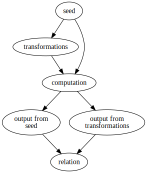

slidenumbers: true
slidecount: true
footer: Zach Mitchell

# Monarch
### Metamorphic testing in Rust

Zach Mitchell

---

# How do you write a basic test?

* I know the exact input
* I know what the exact output should be
* I feed my code the input
* Does the computed output match the expected output?

---

# Pros

* Easy to write
* Inputs/outputs are clearly laid out
* Easy to debug
* Built-in for Rust

---

# Cons

* **You** have to know the edge cases ahead of time
* **You** have to come up with the inputs/outputs
* Duplication of code
* Lots of tests required to get good coverage

---

# Working smarter with generative testing

In order of complexity:

* Metamorphic testing
* Property-based testing
* Mutation testing (not discussed here)

---

# Property-based testing (PBT)

* Randomly generate an instance of the input type
* Run it through your code
* Assert something about the output
* Repeat many times (\~1000x) per test

---

# Pros

* Fewer tests required
* Better coverage
* Helps discover edge cases
* Developer is no longer responsible for
    * Knowing what to test for (to a degree)
    * Coming up with inputs/output

---

# Cons

* More complex to set up
* Tests are slower
* Worse visibility into the values passing through your code
* Harder to debug broken tests

---

# PBT libraries

* QuickCheck
* Hypothesis (Python) 
* Proptest (Rust)

---

# Metamorphic testing



* Supply a seed value
* Supply transformations for the seed
* Compute results from seed and transformed values
* Verify that they satisfy some relation

---

# Key features

* For N transformations you get:
    * 2^N - 1 tests if the order doesn't matter
    * More if order does matter
* You know exactly what the input is
* You don't need to know the outputs

---

# Example - Search API

* Seed: query request
* Computation: return search results
* Transformations:
    * Change pagination
    * Change sort order
    * Etc
* Relation: same number of results

---

# Monarch - Metamorphic testing in Rust

```rust
let mut runner: MetamorphicTestRunner<String, usize> = MetamorphicTestRunner::new();
runner.set_input(String::from("Hello, World!"));
runner.set_relation(|&orig_len, &trans_len| orig_len == trans_len);
runner.set_operation(|foo| foo.len() );
runner.add_transformation(|foo| foo.to_ascii_uppercase());
runner.add_transformation(|foo| foo.to_ascii_lowercase());
...
runner.run().unwrap();
```

---

# Monarch internals

[.code-highlight: all]
[.code-highlight: 1]
[.code-highlight: 2]
[.code-highlight: 3]
[.code-highlight: 4]
[.code-highlight: 5]

```rust
pub struct MetamorphicTestRunner<IN: Clone + Debug, OUT> {
    input: Option<IN>,
    operation: Option<Box<dyn Fn(&IN) -> OUT>>,
    transformations: Vec<Box<dyn Fn(&mut IN) -> IN>>,
    relation: Option<Box<dyn Fn(&OUT, &OUT) -> bool>>,
}
```

--- 

# Current status

* **Very** rough
* Doesn't tell you which test case fails
* Doesn't *actually* compute all test cases
* Uncertain about the current API
* Code smells galore

---

# Resources

* [Metamorphic testing - Hillel Wayne](https://www.hillelwayne.com/post/metamorphic-testing/)
