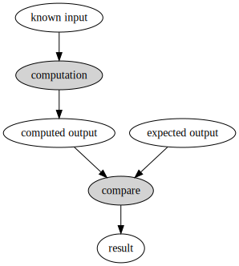
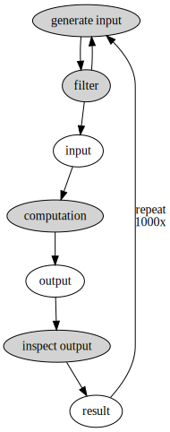
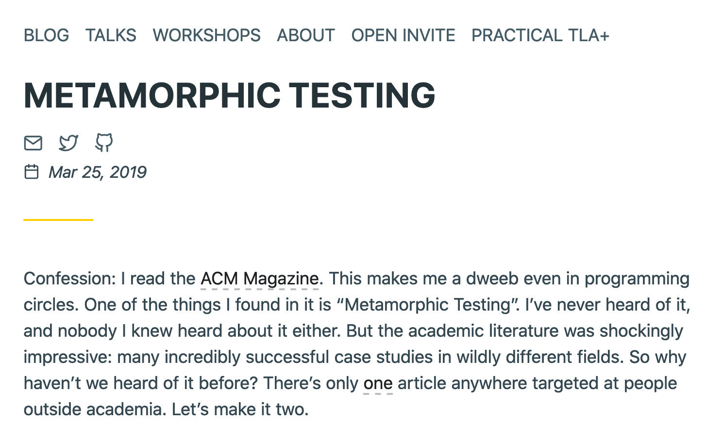
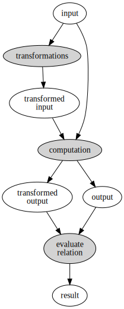

slidenumbers: true
slidecount: true
footer: Zach Mitchell

<!-- # Monarch -->
# Metamorphic testing in Rust

Zach Mitchell

^I'm wondering how many of you thought I was going to talk about mutation testing.

^Sorry

^We're going to talk about metamorphic testing in the context of other testing methodologies.

---

# A basic test



* Must already know the answer
* Directly compare expected and computed outputs
* **You** have to decide which inputs to use
* Duplicated code for similar tests

^ computation = code you're testing

^Simple, easy to write

^This method has some issues

---

# Property-based testing



* Inputs are generated and filtered to useful subset
* Make general assertions about the output
* Better coverage
* Worse specificity since you don't know what the input is ahead of time

^Let the computer do some of the heavy lifting

^inspect: asserting some property of the code under test

^I use PBT frequently, but again there are tradeoffs

---

# Hillel Wayne Appears!



^Hillel Wayne: formal methods and other stuff

^Saw this blog post, thought: that's cool, doesn't sound hard to do

^Aside: Met him while I was visiting Chicago, gave me chocolate

---

# Metamorphic testing



* Supply an input and ways to transform the input
* Apply all combinations of transformations
* Compute results from original and transformed inputs
* Verify that the two results satisfy some relation

^ Compute the output like usual

^Supply a set of transformations that monkey with the input

^Compute those outputs

^Evaluate some relation between output and each transformed output

---

# Key features

* For `N` transformations you get:
    * `2^N - 1` test cases if the order doesn't matter
    * More when order does matter
* You know exactly what the input is
* You don't need to know the outputs ahead of time

---

# When does this make sense?

* Determining many expected outputs is infeasible
* Available properties are too general to be useful
* You want lots of specific, easily-inspectable test cases

---

# Example - Embroidery service

* Given a photo of embroidery.
* Return a sequence of instructions to reproduce it.
* What properties are you going to test?
* Who's going to sit down and transcribe the expected outputs?

^Let's say your name is Jean

---

# Example - Search API

* Input: HTTP request for query
* Computation: return search results
* Transformations:
    * Change pagination
    * Change sort order
    * Etc
* Relation: same total number of results

---

# Monarch - Metamorphic testing in Rust

```rust
let mut runner: MetamorphicTestRunner<i32, i32> = MetamorphicTestRunner::new();
runner.set_input(0);
runner.set_relation(|&orig, &trans| orig > trans);
runner.set_operation(|&x| x);
runner.add_transformation(|&mut x| x + 1);
runner.add_transformation(|&mut x| x - 1);
runner.run().unwrap();
```

---

# Monarch internals

```rust
pub struct MetamorphicTestRunner<IN: Clone + Debug, OUT> {
    input: Option<IN>,
    operation: Option<Box<dyn Fn(&IN) -> OUT>>,
    transformations: Vec<Box<dyn Fn(&mut IN) -> IN>>,
    relation: Option<Box<dyn Fn(&OUT, &OUT) -> bool>>,
}
```

Not much going on here!

---

# Resources

* [https://github.com/zmitchell/monarch](https://github.com/zmitchell/monarch)
* [Metamorphic testing - Hillel Wayne](https://www.hillelwayne.com/post/metamorphic-testing/)
