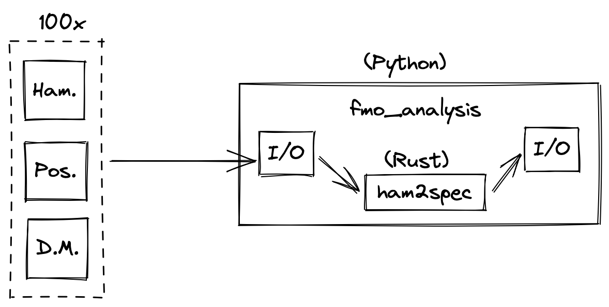

slidenumbers: true
slidecount: true
footer: Zach Mitchell

# An optimization story

Zach Mitchell

---

# Me

- PhD Candidate at Purdue University
- Experimental physicist
    - Nanosecond/femtosecond dynamics of energy transfer between molecules
- Using Rust since about 2018

---

# Minimum Viable Physics


---

# Minimum Viable Physics

[.column]
[.autoscale: true]

- Collaborators do molecular dynamics simulations
- Process
    - Start with locations of all atoms
    - Simulate protein jiggling to find equilibrium positions
    - Take `N` snapshots of positions
    - Compute physical properties from the `N` snapshots
    - Give results to Zach

[.autoscale: false]

[.column]


---

# Minimum Viable Physics

[.column]
[.autoscale: true]

- Given `N` molecules
    - `N = 8` for me
- Hamiltonian
    - `N x N` matrix
- Positions
    - `N x 3` array
- "Transition dipole moments"
    - Physical property of each molecule
    - `N x 3` array
- One set of these for each snapshot (100 sets)

[.autoscale: false]

[.column]


---

# Minimum Viable Physics

[.column]


[.column]


---

# Computation


Note: running this on my laptop, using Python/NumPy

---

# Computation


---

# Problem

- I need to fit tweaks to the Hamiltonians
- Computation is *fast enough* when run once
    - 400ms for 100 snapshots
- Fitting can run the computation 50,000x
    - Runtime is very sensitive to initial guesses
    - Bad guesses -> 8+ hours to complete
- Don't know if my guesses are good or bad beforehand

---

# Goals

- Bring runtime from 8 hours to 5 minutes
    - 100x speedup
- Run simulations locally
- Code should still be legible

---

# Initial profiling


- Computing a single spectrum
- Stick spectrum is 87.5% of runtime
- Broadening is 10%

---

# `make_stick_spectrum`

```python
def make_stick_spectrum(config, ham, pigs):
    # Diagonalize Hamiltonian
    e_vals, e_vecs = np.linalg.eig(ham)
    ...
    for i in range(n_pigs):
        # Compute stick absorption
        exciton_mus = ...
        stick_abs[i] = np.dot(exciton_mus[i], exciton_mus[i])
        ...
        for j in range(n_pigs):
            for k in range(n_pigs):
                # Compute stick CD
                ...
                stick_cd[i] += e_vecs[j, i] * e_vecs[k, i] * np.dot(r, mu_cross)
```

---

# `line_profiler`

[.code-highlight: 3,6,7,8,9,10]
```
    63        56        102.0      1.8      1.0          for j in range(n_pigs):
    64       392        689.0      1.8      6.6              for k in range(n_pigs):
    65       343       1167.0      3.4     11.1                  r = pigs[j].pos - pigs[k].pos
    66                                                           # NumPy cross product function is super slow for small arrays
    67                                                           # so we do it by hand for >10x speedup. It makes a difference!
    68       343       1112.0      3.2     10.6                  mu_cross = np.empty(3)
    69       343       1230.0      3.6     11.7                  mu_cross[0] = pigs[j].mu[1] * pigs[k].mu[2] - pigs[j].mu[2] * pigs[k].mu[1]
    70       343        953.0      2.8      9.1                  mu_cross[1] = pigs[j].mu[2] * pigs[k].mu[0] - pigs[j].mu[0] * pigs[k].mu[2]
    71       343       1020.0      3.0      9.7                  mu_cross[2] = pigs[j].mu[0] * pigs[k].mu[1] - pigs[j].mu[1] * pigs[k].mu[0] 
    72       343       2611.0      7.6     24.8                  stick_cd[i] += e_vecs[j, i] * e_vecs[k, i] * np.dot(r, mu_cross)
```

77% of runtime is computing stick CD

---

# Optimizations

- Look up pigment position once
    - 25% speedup

```python
for j in range(n_pigs):
    for k in range(n_pigs):
        pig_j = pigs[j]
        pig_k = pigs[k]
        r = pig_j.pos - pig_k.pos
        mu_cross = np.empty(3)
        mu_j = pig_j.mu
        mu_k = pig_k.mu
        ...
```
--- 

# Optimizations

- Computations are symmetric in `j` and `k`
    - Calculate once, multiply by 2
    - 63% speedup

[.code-highlight: 2,5]
```python
for j in range(n_pigs):
    for k in range(j, n_pigs):  # Notice the "j" here now!
        ...
        # Notice the "2" here now!
        stick_cd[i] += 2 * e_vecs[j, i] * e_vecs[k, i] * r_mu_dot
```

--- 

# Optimizations
- `j = k` always gives 0
    - 21% speedup

[.code-highlight: 2]
```python
for j in range(n_pigs):
    for k in range(j+1, n_pigs):  # Notice the "+1" here!
```

---

# Optimizations

- `np.dot(r, mu_cross)` doesn't depend on `i`
    - Compute it once outside the loops
    - 55% speedup

[.code-highlight: 1,6,7]
```python
r_mu_cross_cache = make_r_dot_mu_cross_cache(pigs)
for i in range(n_pigs):
    exciton_mus[i, :] = np.sum(np.repeat(e_vecs[:, i], 3).reshape((n_pigs, 3)) * pig_mus, axis=0)
    stick_abs[i] = np.dot(exciton_mus[i], exciton_mus[i])
    ...
    e_vec_weights = make_weight_matrix(e_vecs, i)
    stick_cd[i] = 2 * stick_coeff * np.dot(e_vec_weights.flatten(), r_mu_cross_cache.flatten())
```

---

# Checking in

Run the profiler again:
- 50% diagonalizing the Hamiltonian
- 16% making the cache
- 9% making the weights to go along with the cache
- 10% computing the exciton dipole moments

---

# Calling LAPACK directly

[.autoscale: true]
Before

```python
e_vals, e_vecs = np.linalg.eig(ham)
```

After, 7% faster

```python
e_vals_fortran_order, _, _, e_vecs_fortran_order, _ = lapack.sgeev(ham)
e_vals = np.ascontiguousarray(e_vals_fortran_order)
e_vecs = np.ascontiguousarray(e_vecs_fortran_order)
```

[.autoscale: false]

---

# Choosing Rust

- I've only made things 4x faster
    - Well short of my 100x goal
- Still dominated by diagonalization
    - Not something I can fix from Python side
- Lacking control over allocations
- No easy way to write cache-friendly code
    - `sys.getsizeof(1234)` -> 28 bytes

---

# Ecosystem

[.autoscale: true]

- PyO3
    - Wraps Rust with CPython API
- maturin
    - Builds and Rust into Python module
- ndarray
    - NumPy-like n-dimensional arrays in Rust
- rust-numpy
    - NumPy <-> ndarray conversion

[.autoscale: false]

---

# Ecosystem

Great:
- Python interop is shockingly easy

Needs work:
- Have to deal with Python packaging
- Documentation is sparse
- Python types in Rust are weird
    - Upcasting/downcasting references
    - Interior mutability

---

# New architecture



---

```rust
/// Compute absorbance and CD spectra from first principles.
#[pymodule]
fn ham2spec(_py: Python, m: &PyModule) -> PyResult<()> {
    ...
    /// Compute the absorbance and CD stick spectrum of a single Hamiltonian
    ///
    /// `ham`: An NxN Hamiltonian matrix
    /// `mus`: An Nx3 array of dipole moments, one row for each pigment
    /// `rs`: An Nx3 array of positions, one row for each pigment
    #[pyfn(m)]
    #[pyo3(name = "compute_stick_spectrum")]
    fn compute_stick_spectrum_py<'py>(
        py: Python<'py>,
        ham: PyReadonlyArray2<f64>,
        mus: PyReadonlyArray2<f64>,
        rs: PyReadonlyArray2<f64>,
    ) -> PyObject {
        let stick = compute_stick_spectrum(ham.as_array(), mus.as_array(), rs.as_array());
        stick.to_object(py)
    }
    ...
}
```

---

# Automatic type conversion

```rust
#[derive(Debug, Clone, FromPyObject)]
pub struct BroadeningConfig {
    /// The starting point for the x-axis in wavenumbers (cm^-1)
    #[pyo3(attribute("xfrom"))]
    pub x_from: f64,

    /// The stopping point for the x-axis in wavenumbers (cm^-1)
    #[pyo3(attribute("xto"))]
    pub x_to: f64,

    /// The step size for the x-axis in wavenumbers (cm^-1)
    #[pyo3(attribute("xstep"))]
    pub x_step: f64,

    ...
}
```

---

# Automatic type conversion

```rust
impl ToPyObject for StickSpectrum {
    fn to_object(&self, py: Python<'_>) -> PyObject {
        let dict = PyDict::new(py);
        // Don't mind the `unwrap`s here, setting a dictionary entry is unlikely to fail
        dict.set_item("e_vals", self.e_vals.to_pyarray(py)).unwrap();
        dict.set_item("e_vecs", self.e_vecs.to_pyarray(py)).unwrap();
        dict.set_item("exciton_mus", self.mus.to_pyarray(py)).unwrap();
        dict.set_item("stick_abs", self.stick_abs.to_pyarray(py)).unwrap();
        dict.set_item("stick_cd", self.stick_cd.to_pyarray(py)).unwrap();
        dict.to_object(py)
    }
}
```

---

# Iterators

```rust
pub fn compute_stick_spectra(
    hams: ArrayView3<f64>,
    mus: ArrayView3<f64>,
    rs: ArrayView3<f64>,
) -> Vec<StickSpectrum> {
    ...
    let mut sticks: Vec<StickSpectrum> = Vec::with_capacity(hams.dim().0);
    sticks.resize(hams.dim().0, dummy_stick);
    Zip::from(hams.axis_iter(Axis(0)))
        .and(mus.axis_iter(Axis(0)))
        .and(rs.axis_iter(Axis(0)))
        .and(&mut sticks)
        .for_each(|h, m, r, s| *s = compute_stick_spectrum(h, m, r));
    sticks
}
```

---

# Where we stand

[.autoscale: true]
- Stick spectra are 100x faster
    - 45% diagonalization
    - 23% exciton dipole moments
    - 24% computing CD
    - Can get 2x faster **at best**
- Effectively eliminated CD runtime
- Only 10x faster overall
    - Still have that 10% broadening runtime

[.autoscale: false]

---

# Parallelism with Rayon

[.code-highlight: 6-15]
```rust
Zip::from(abs_arr.columns_mut())
    .and(cd_arr.columns_mut())
    .and(hams.axis_iter(Axis(0)))
    .and(mus.axis_iter(Axis(0)))
    .and(rs.axis_iter(Axis(0)))
    .for_each(|mut abs_col, mut cd_col, h, m, r| { // Serial
        let stick = compute_stick_spectrum(h, m, r);
        let broadened = compute_broadened_spectrum_from_stick(
            stick.e_vals.view(),
            stick.stick_abs.view(),
            stick.stick_cd.view(),
            config,
        );
        abs_col.assign(&broadened.abs);
        cd_col.assign(&broadened.cd);
    });
}
```

---

# Parallelism with Rayon

[.code-highlight: 6]
```rust
Zip::from(abs_arr.columns_mut())
    .and(cd_arr.columns_mut())
    .and(hams.axis_iter(Axis(0)))
    .and(mus.axis_iter(Axis(0)))
    .and(rs.axis_iter(Axis(0)))
    .par_for_each(|mut abs_col, mut cd_col, h, m, r| { // Parallel
        ...
    });
}
```

127% speedup, 22x faster overall (with only 2 cores)

---

# Doing less work

[.column]
[.autoscale: true]
- `cargo-flamegraph` says 55% is just from `exp`
- I can't make `exp` faster
    - I can call it fewer times
- Skip computations where their contributions are small
- 117% speedup, 47x faster overall

[.autoscale: false]

[.column]


---

# Failed attempts

[.column]
- Reading the assembly
    - I'm an assembly n00b
- Loop unrolling
    - Already being done
- Is it vectorized?
    - Parts of it

[.column]
- Explicit SIMD using `packed_simd`
    - Only 7% faster
    - Only have 128 bit registers, 2 `f64`s instead of one
- Cachegrind
    - Not familiar enough to use it effectively

---

# Moving forward

- 50x faster is close enough
- New laptop on the way
    - More cores
    - Wider SIMD registers
        - 512 bits vs 128 bits

---

# Final words

- Why didn't you rewrite in Julia, Fortran, etc?
    - Existing simulations written in Python
    - Need to leave something easy for the next student
- Why didn't you use
    - Numba (forgot it existed, slow runtime compilation)
    - Dask (overhead, still Python)
    - etc

---

# Resources

[.autoscale: true]
- Article
    - https://tinkering.xyz/fmo-optimization-story
- Me
    - https://github.com/zmitchell
- Slides made with (macOS only)
    - https://www.deckset.com/
- Drawings made with (free)
    - https://excalidraw.com

[.autoscale: false]