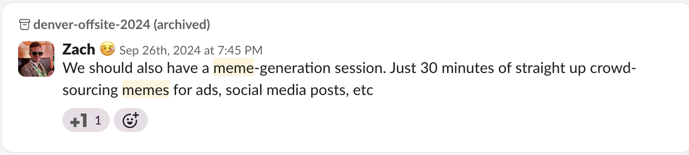
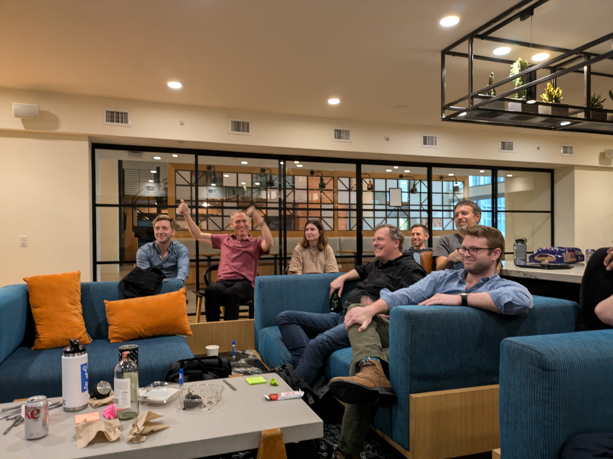
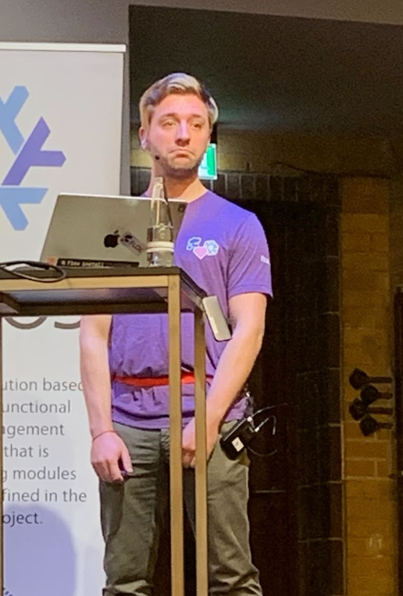
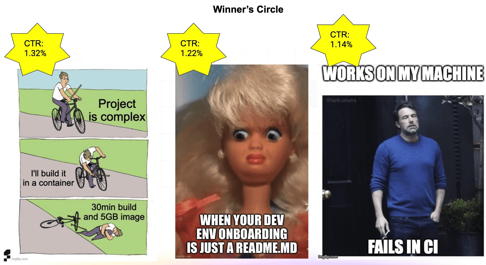

A meme lord is born
---
<!-- font_size: 2 -->
- October 17, 2024
- Denver, CO
- Collected memes for a competition



<!-- end_slide -->

A meme lord is born
---



<!-- end_slide -->

A meme lord is born
---



<!-- end_slide -->

A meme lord is born
---
<!-- column_layout: [1, 1] -->
<!-- column: 0 -->

<!-- font_size: 2 -->
- Ads were put on LinkedIn, Reddit
- Winners were chosen by click-through-rate

<!-- column: 1 -->


<!-- end_slide -->

A meme lord is crowned
---

<!-- font_size: 2 -->
<!-- alignment: center -->
All three of these are mine



<!-- end_slide -->

Why am I telling you this?
---

<!-- font_size: 2 -->
- Developers don't seem to love their tools
- May not be _pressing_, but still unsatisfying
- Frustration with your tools is a deeply relatable experience

<!-- end_slide -->

An example
---
<!-- font_size: 2 -->
- A previous job
- Could only work in a container on a remote VM
- Multi-stage build with two languages in the same repo
- Constant cache invalidations
- Constantly rebuiding `flatc` from source
- 45min builds were typical

<!-- end_slide -->

Identifying the problem
---
<!-- font_size: 2 -->
- Two language toolchains fighting over priority
- Needless rebuilds of a pinned dependenc (`flatc`)
- Duplicated effort installing the same packages repeatedly
- Two layers of "remote" (VM + container)
- Very slow feedback cycle (45min)

<!-- end_slide -->

What are the qualities of a _good_ developer environment?
---
<!-- font_size: 2 -->
- Reusable
- Composable
- Flexible
- Unobtrusive
- Unrestrictive
- Fast
- Efficient
- Reliable
- Approachable

<!-- end_slide -->

Existing solutions
---
<!-- font_size: 2 -->
- Containers/VMs
- Nix

They have _**some**_ of the good properties, but not enough of them, and not without other significant drawbacks.

I'll show that Flox hits the sweet spot even though it's relatively young.

<!-- end_slide -->

Containers and VMs
---

<!-- font_size: 2 -->
Goal: prepare an image in a certain state.
- Given a starting state
- Run a sequence of imperative commands

Problem: this build process is generally not reproducible.

<!-- end_slide -->

Nix speedrun
---

<!-- font_size: 2 -->
Goal: describe computations that produce artifacts from inputs.

Problem: hard for mere mortals to comprehend.

<!-- end_slide -->

Nix speedrun
---

```docker
FROM ubuntu:22.04

# Install packages
RUN apt-get update && \
    apt-get install -y \
    curl ripgrep

# Add source files
COPY ./src /app

# Copy the builder script
COPY ./builder.sh /builder.sh

# Set environment variable
ENV FOO="BAR"

# Default command
CMD ["/bin/bash", "builder.sh"]
```

<!-- end_slide -->

Nix speedrun
---

```json
{
  "deps": [
    "curl",
    "ripgrep",
  ],
  "src": "./src",
  "builder": "./builder.sh",
  "env": {
    "FOO": "BAR"
  },
  "cmd": [
    "/bin/bash",
    "builder.sh"
  ]
}
```

<!-- end_slide -->

Nix speedrun
---

```nix
{
  curl,
  ripgrep,
  ...
}:
stdenv.mkDerivation {
  buildInputs = [
    curl
    ripgrep
  ];
  src = ./src;
  builder = ./builder.sh;
  env = {
    FOO = "BAR";
  };
}
```

Execution environment is a shell with environment variables carefully set.

<!-- end_slide -->

Flox Speedrun
---

```fish +exec
/// flox delete -f -d myenv 2>/dev/null
/// rm -rf myenv
mkdir myenv && cd myenv # create a new directory
flox init               # create an env in it
flox install hello      # install 'hello' to the env
flox activate -- hello  # run 'hello' in the env
```
