footer: Zach Mitchell - Flox
slidenumbers: true

# [fit] You can't spell "devshell"
# [fit] without
# [fit] "hell"

---

# Today's lesson

- How does `nix develop` work?
- What if we want more?
- `flox activate`
- Why `fish` is objectively the best shell

---

# The environment

- Filesystem + environment = observable universe
- Control them both = control what’s observable
- Strategy
  - Deterministically set the environment
  - Manipulate filesystem via symlinks

---

# [fit] nix
# [fit] develop

---

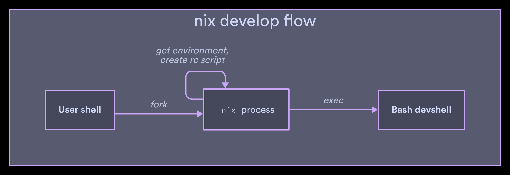

---

# If you want to see for yourself

In `develop.cc`
- `CmdDevelop::run`
- `getBuildEnvironment`
- `getDerivationEnvironment`
- `struct BuildEnvironment`
- `makeRcScript`
- `getShellOutpath`

---

# Trivia!

- `nix-shell` and `nix develop`
  - Designed for debugging builds
  - Both recreate the _build environment_ of a derivation
  - Not the same as a general purpose developer environment

Try running `buildPhase` inside `nix develop`

---

# Trivia!

```
$ cd flox
$ nix develop
$ buildPhase
no Makefile or custom buildPhase, doing nothing
!!!!!!!!!!!!!!!!!!!!!!!!!!!!!!!!!!!!!!!!!!!!!!!!!!!!!!!!!!!!!!!!!!!!!!!!!!!!!!!!!!!!!
$cargoBuildLog is either undefined or does not point to a valid file location!
By default the installFromCargoBuildLogHook will expect that cargo's output
was captured and can be used to determine which binaries should be installed
(instead of just guessing based on what is present in cargo's target directory)

If you are defining your own custom build step, you have two options:
1. Set `doNotPostBuildInstallCargoBinaries = true;` and ensure the installation
   steps are handled as appropriate.
2. ensure that cargo's build log is captured in a file and point $cargoBuildLog at it

At a minimum, the latter option can be achieved with a build phase that runs:
     cargoBuildLog=$(mktemp cargoBuildLogXXXX.json)
     cargo build --release --message-format json-render-diagnostics >"$cargoBuildLog"
!!!!!!!!!!!!!!!!!!!!!!!!!!!!!!!!!!!!!!!!!!!!!!!!!!!!!!!!!!!!!!!!!!!!!!!!!!!!!!!!!!!!!
```

---

# First steps

- Run `nix develop .#foo`
- Find the derivation for `foo`

---

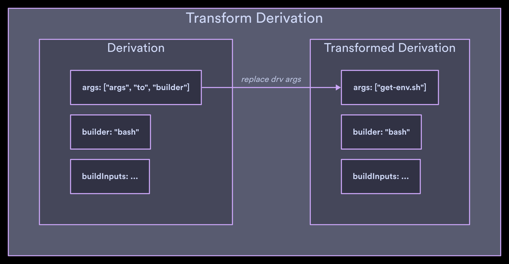

---

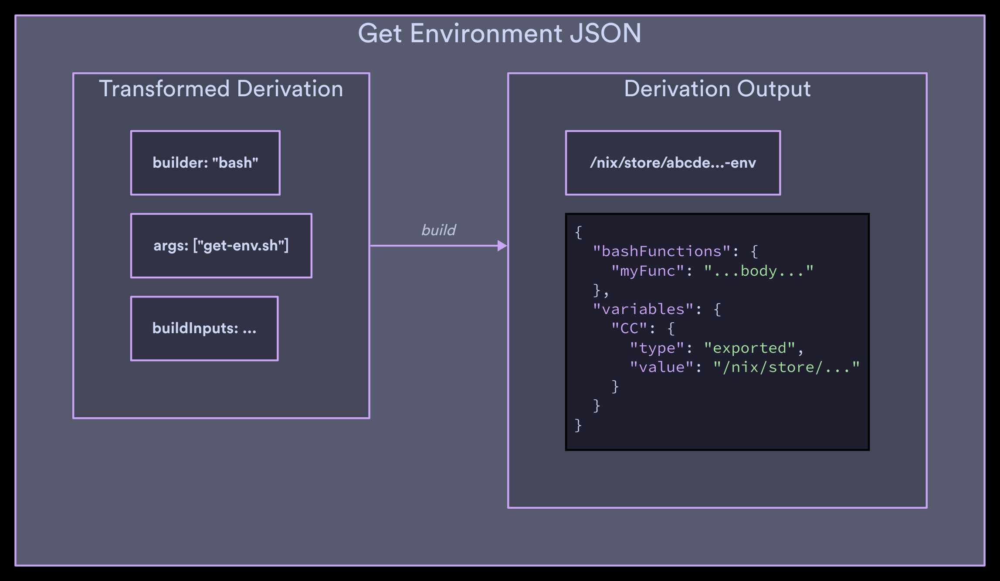

---

# `get-env.sh`

```bash
# ...

# This populates PATH, etc from the derivation inputs
if [[ -n $stdenv ]]; then
    source $stdenv/setup
fi

# ...

__vars="$(declare -p)"
__functions="$(declare -F)"

__dumpEnv() {
  # Construct JSON object *line by line*
  # from __vars and __functions
}

# ...
```

---

# Getting the function definitions

```bash
if ! [[ $__line =~ ^declare\ -f\ (.*) ]]; then continue; fi
__fun_name="${BASH_REMATCH[1]}"
__fun_body="$(type $__fun_name)"
if [[ $__fun_body =~ \{(.*)\} ]]; then
    if [[ -z $__first ]]; then printf ',\n'; else __first=; fi
    __fun_body="${BASH_REMATCH[1]}"
    printf "    "
    __escapeString "$__fun_name"
    printf ':'
    __escapeString "$__fun_body"
else
    printf "Cannot parse definition of function '%s'.\n" "$__fun_name" >&2
    return 1
fi
```

---


---

# Getting the variable definitions

```bash
if ! [[ $__line =~ ^declare\ (-[^ ])\ ([^=]*) ]]; then continue; fi
local type="${BASH_REMATCH[1]}"
local __var_name="${BASH_REMATCH[2]}"

if [[ $__var_name =~ ^BASH_ || \
      $__var_name =~ ^COMP_ || \
      # <snip>
    ]]; then continue; fi

if [[ -z $__first ]]; then printf ',\n'; else __first=; fi

printf "    "
__escapeString "$__var_name"
printf ': {'

# FIXME: handle -i, -r, -n.
if [[ $type == -x ]]; then
    printf '"type": "exported", "value": '
    __escapeString "${!__var_name}"
elif [[ $type == -- ]]; then
    printf '"type": "var", "value": '
    __escapeString "${!__var_name}"
elif [[ $type == -a ]]; then
    printf '"type": "array", "value": ['
    local __first2=1
    # <snip>
    printf ']'
elif [[ $type == -A ]]; then
    printf '"type": "associative", "value": {\n'
    local __first2=1
    declare -n __var_name2="$__var_name"
    # <snip>
    printf '\n    }'
else
    printf '"type": "unknown"'
fi

printf "}"
```

---


---

# Viewing the JSON

```bash
$ nix print-dev-env --json
```

```json
{
  "bashFunctions": {
    "myFunc": "...body..."
  },
  "variables": {
    "CC": {
      "type": "exported",
      "value": "/nix/store/..."
    },
  }
}
```

---

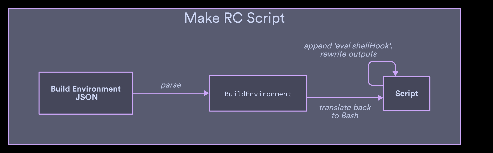

---

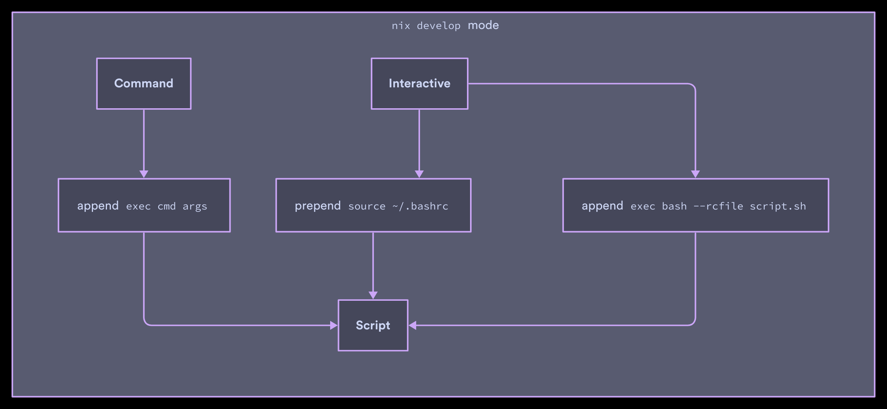

---

# "Just exec your shell"

- `nix develop` only supports Bash
- You want to use `<shell>`
- Advised to `nix develop -c exec <shell>`
- WRONG
  - Shell's RC files will run _after_ Nix setup
  - All kinds of shenanigans can happen

---

# Modify, don't overwrite some variables

- `PATH`, `XDG_DATA_DIRS`
- Only including things from the devshell would cause major breakage
- Prepend to these instead of overwriting

---

# Temp directories

- Create a temporary directory `nix-shell.XXXXXX`
- Point all temp-like directories at it
  - `TMP`, `TEMP`, `TMPDIR`, `TEMPDIR`

```
$ echo $TMP
/tmp/nix-shell.NUgD1Q
```

---

# Rewrite outputs

- Normally `$out` points at the destination in the store
- Rewrite occurences of that store path to `./outputs/<output>`
- Prevents you from writing garbage to the store during development

```
$ echo $out
/Users/zmitchell/src/flox/main/outputs/out
```

---

# Garbage collection

- Set `NIX_GCROOT` to script path in `nix` process
- Nix garbage collector uses `/proc` to scan for GC roots in running processes
  - See `LocalStore::findRuntimeRoots`

---

# Write out the shell script

```bash
$ nix print-dev-env
unset shellHook
PATH=${PATH:-}
nix_saved_PATH="$PATH"
...
```
---

# Write out the shell script

```bash
$ nix build --print-out-paths --no-link \
 .#devShells.aarch64-darwin.default
/nix/store/zkh8q1m320573982wvqq68wgcaf50af6-flox-dev

$ cat /nix/store/zkh8q1m320573982wvqq68wgcaf50af6-flox-dev
unset shellHook
PATH=${PATH:-}
nix_saved_PATH="$PATH"
...
```

---

# [fit] flox
# [fit] activate

---

# Different goals

- Same reproducibility as `nix develop`
- 4 different shells
  - Bash, Zsh, Fish, and tcsh
- 2 different closures
  - "develop" and "runtime" modes
- "Immediate" activation

---

# Additional requirements

- Layered activations
- Share resources between activations
- Services w/ automatic shutdown on exit
- Tidy `PATH`

---

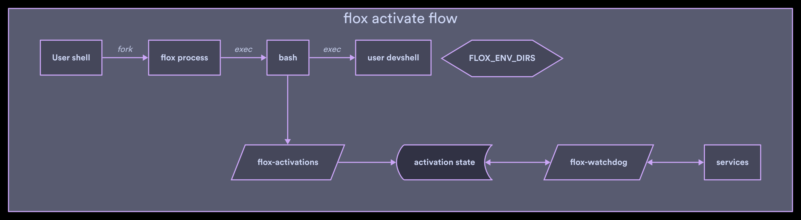

---


---

# Completely different architecture

- Everything needed to run the shell is already built
- Eagerly rebuilt when `flox` commands modify the environment
- Rebuilt on the fly when a `flox` command detects manual edits.

---

# Built ahead of time

```
❯ tre -a .flox -l 2
.flox
├── env.json
├── .gitignore
├── env
│   ├── manifest.toml # <-- config file
│   └── manifest.lock # <-- lockfile
├── run
│   ├── x86_64-linux.rfcp.run  # <-- symlink to "runtime" closure
│   └── x86_64-linux.rfcp.dev  # <-- symlink to "develop" closure
├── log
├── cache
└── .gitattributes
```

---

# Recursively merged FHS

```
❯ tre -a .flox/run/x86_64-linux.rfcp.dev -l 1
.flox/run/x86_64-linux.rfcp.dev
├── requisites.txt
├── etc
├── bin         # <-- merged '/bin' from entire closure
├── activate    # <-- 'activate' script
├── activate.d  # <-- activation helpers
├── lib
├── share
├── nixpkgs-url
├── include
└── manifest.lock
```

---

# "Immediate" activation

```
❯ time flox activate -- /run/current-system/sw/bin/true

________________________________________________________
Executed in   56.05 millis    fish           external
   usr time   31.85 millis  211.00 micros   31.64 millis
   sys time   26.39 millis  141.00 micros   26.25 millis
```

```
❯ time fish -c /run/current-system/sw/bin/true

________________________________________________________
Executed in   15.99 millis    fish           external
   usr time    7.93 millis  292.00 micros    7.64 millis
   sys time    8.01 millis  142.00 micros    7.87 millis
```

---

# "Immediate" activation

- No evaluation on the way to activation
- Rate limiting step is often your own dotfiles
- "Quick enough" for the moment, but there's low hanging fruit

---

# I wrote a profiler: proctrace

- Uses `bpftrace` to track forks/execs and timing
- Generates Gantt chart syntax for Mermaid.js
- Broken/wrong in various ways at the moment, don't use it
- https://github.com/zmitchell/proctrace
- proctrace.xyz

---

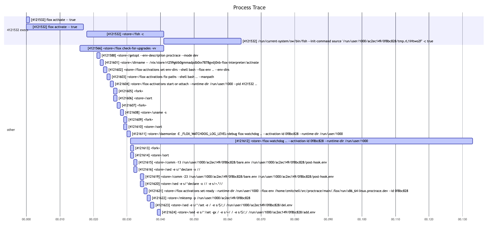

---

# Completely different architecture

- Two different shell hooks
  - `hook.on-activate`: shell-agnostic setup
  - `profile.*`: sourced by user shell
- Start vs. attach
  - Start does full activation (first time)
  - Attach replays aliases + env (subsequent activations)

---

# manifest.toml

```toml
version = 1

[install]
ripgrep.pkg-path = "ripgrep"

[hook]
on-activate = '''
  echo "hello from hook.on-activate"
'''

[profile]
fish = '''
  echo "hello from profile.fish"
  alias myalias "my alias cmds"
'''
```

---


---

# Completely different architecture

- Need to keep track of instances of activated envs
  - `flox-watchdog` -> background process, one per env
  - activation state -> used for attach
  - One set of services shared between activations of an env
- Always possible that we're about to layer activations
  - `$FLOX_ENV` -> current activation
  - `$FLOX_ENV_DIRS` -> all activations in this shell

---

# Generic setup

- `activate` script is written in Bash
- One consistent language for all of the shell-agnostic parts
- Defer shell-specific parts to the very end

---

# First step: set `FLOX_ENV_DIRS`, `PATH`, `MANPATH`

- All `activate` code is aware that multiple activations may already be stacked
- ex.) `PATH` needs to contain:
  - `bin`/`sbin` directories from all active environments.
  - In most-recently-activated order
  - But also what was already in `PATH`

---

# Big, difficult problem

- Implement consistent behavior
- `N` shell dialects with different:
  - Quoting rules
  - Array support
  - Rules for `source` and `eval`
  - etc

---


---

# The Abyss

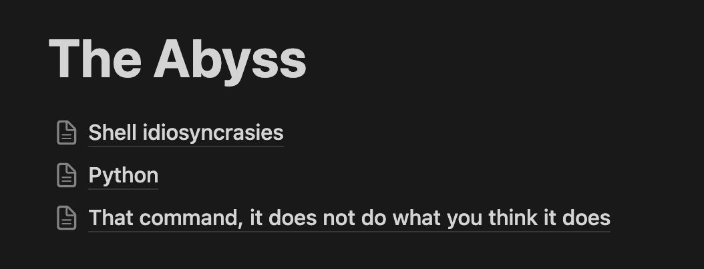

---

# The Abyss

- Bash and Zsh support hieroglyphics
  - `"${@@Q}"`
  - `"${foo##*/}"`
- Woe unto you if you forget to quote something

---

# The Abyss

- tcsh has no equivalent of `"${foo:-}"`
  - (default to empty string if unset or null)

---

# The Abyss

- Don't tell tcsh to eval a string containing `#`
  - Often won't treat it as a comment character
  - '`#: Command not found`'
  - Other times comments out the rest of the input
  - `\n` and `;` don't help

Trust me, just don't

---

# The Abyss

- tcsh sometimes just...won't let you quote something

```
eval "`cmd "arg"`"
#          ^^^^^ straight to jail
```

- Use `arg:q` to quote `arg`

---

# The Abyss

- jk that doesn't work in backticks
- Use `:Q`

---

# The Abyss

- jk that only works in "new" tcsh versions

---


---

# The Abyss

- tcsh doesn't have an `IFS` variable
  - Good luck reading `PATH` into an array

---

# The Abyss

- Zsh has both `$fpath` and `$FPATH`
  - `$fpath` is an array
  - `$FPATH` is like `$PATH`
  - Set `$fpath`, all good
  - Set `$FPATH`, subshells won't load default paths

---

# The Abyss

- Everything is a list/array in Fish
- As a result, these are printed differently
  - `$PATH`
  - `"$PATH"`
- `fish_prompt` is a function
  - Produces the format string when executed

---

# The Abyss

- Startup files...
  - Zsh has 8
  - Bash has ~6
  - Fish has 2
  - I didn't count for tcsh

---

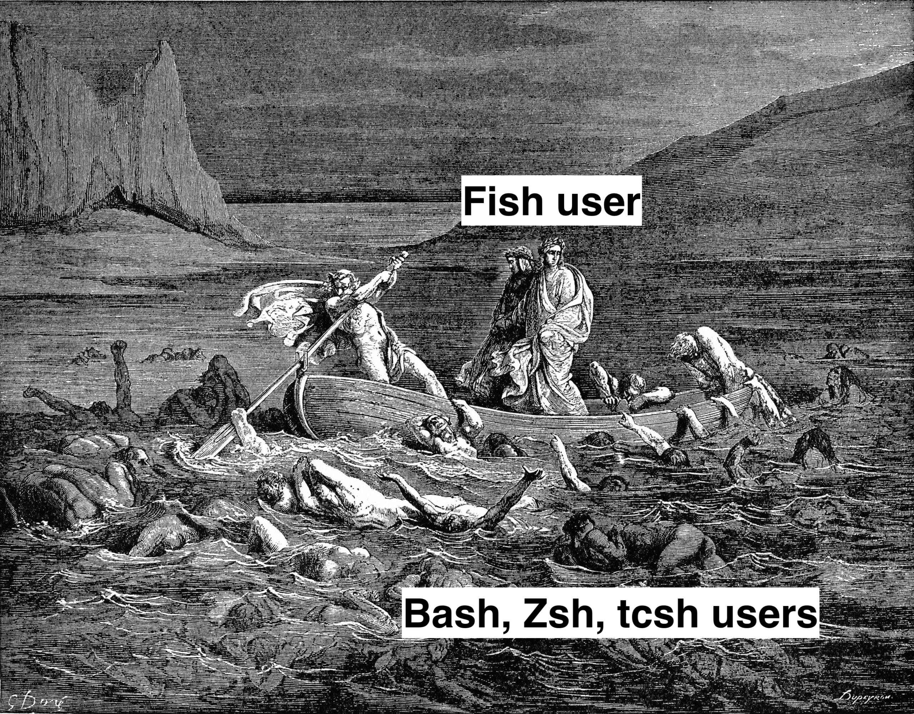

---

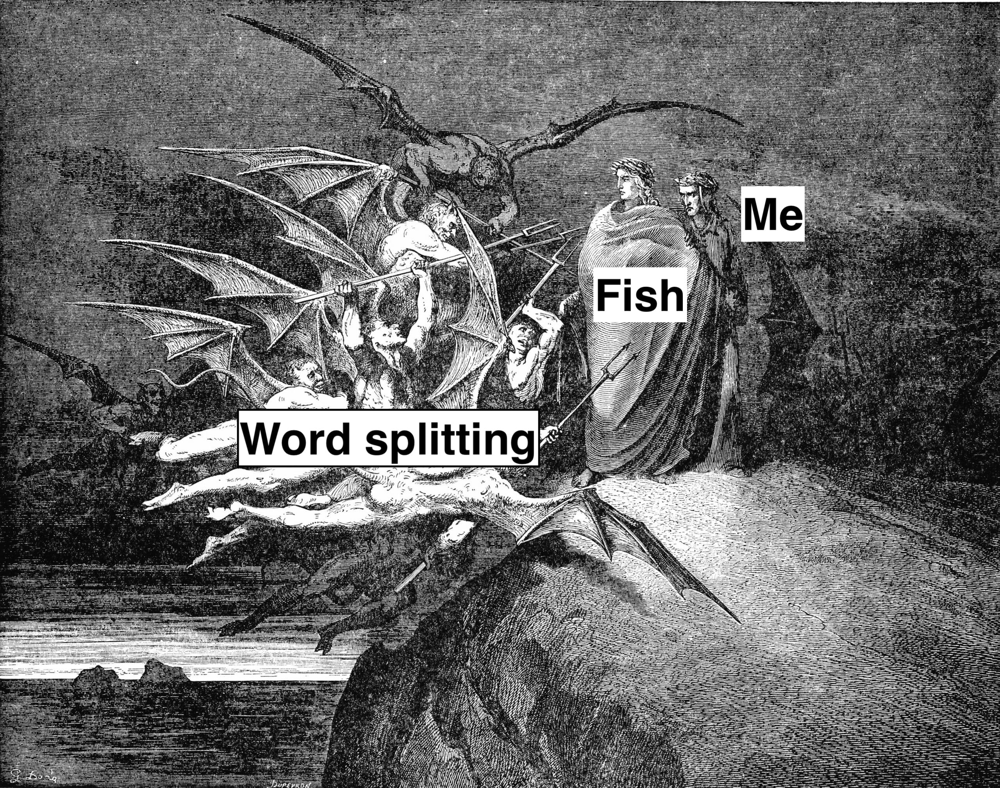

---

# I wrote a tool for that too

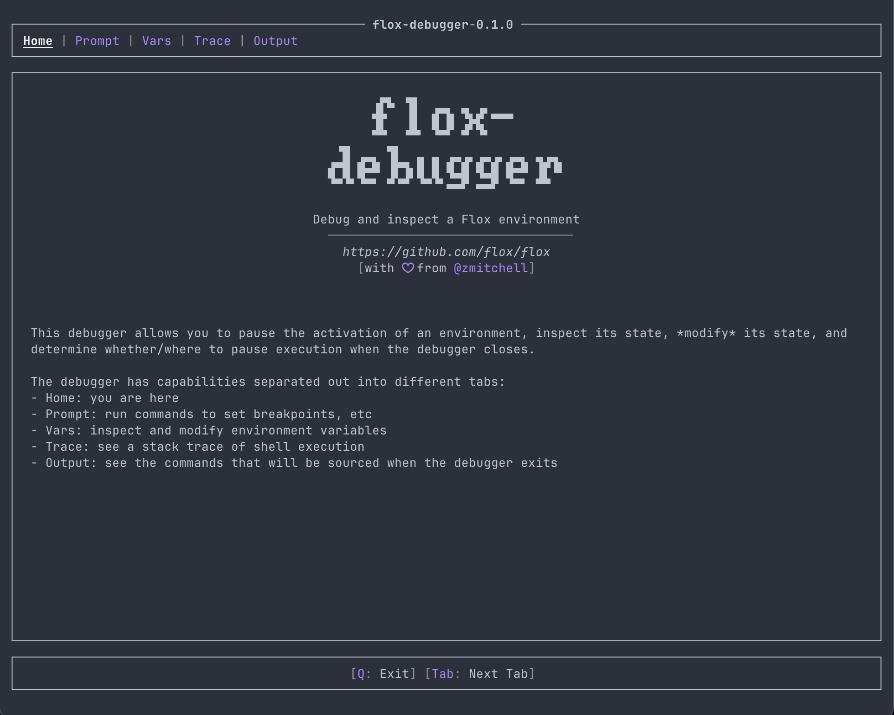

---

# I wrote a tool for that too

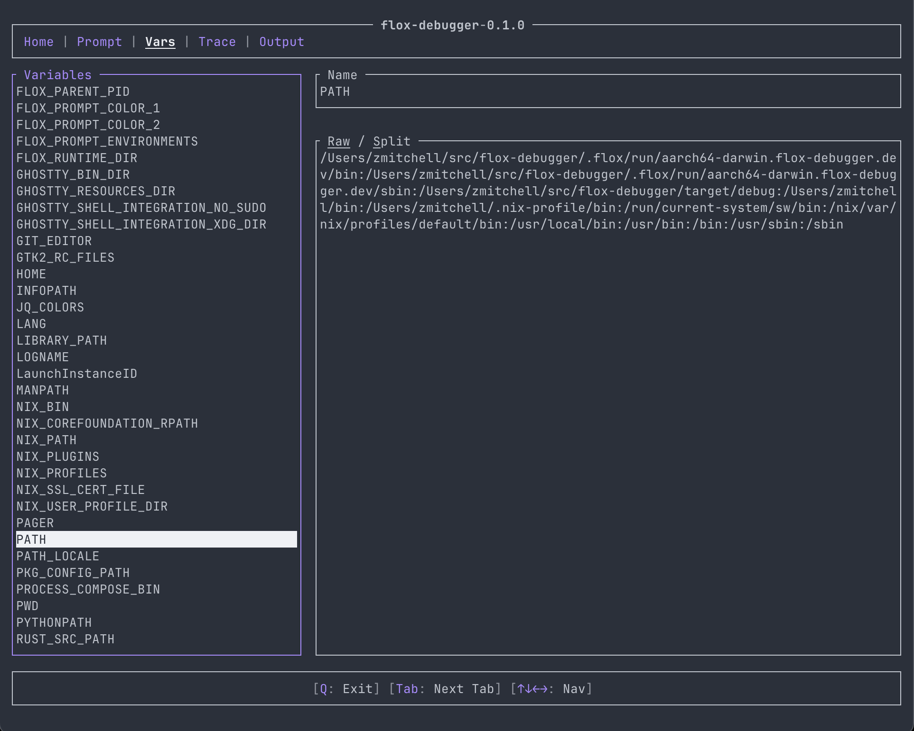

---

# I wrote a tool for that too

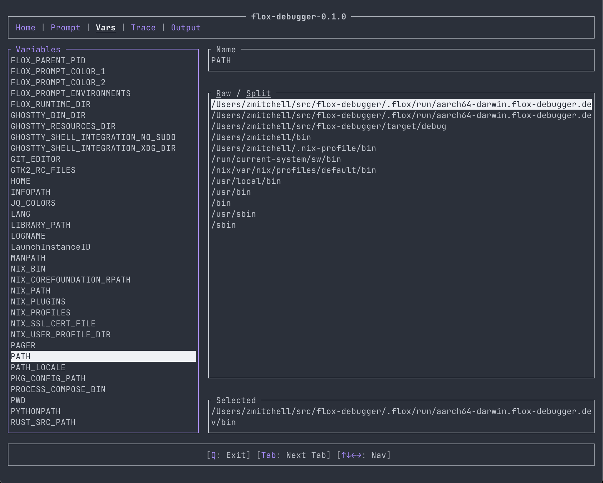

---

# I wrote a tool for that too

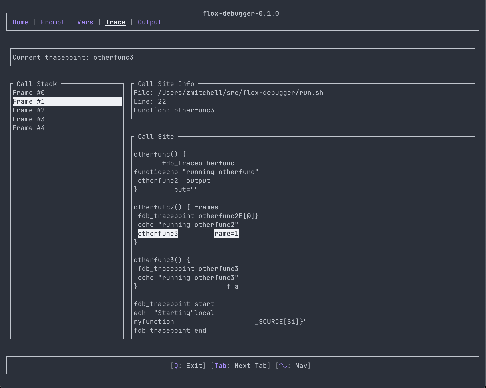

---


---

# Big, difficult problem

- Implement consistent behavior
- `N` shell dialects with different:
  - Quoting semantics
  - Array support
  - Rules for `source` and `eval`
  - etc

---

# Tractable problem

- Implement business logic in few languages
  - Bash for most things
  - Rust where multiple dialects is painful
- Rust
  - Mostly reduces to emitting '`export foo=bar`'

---

# ex.) Setting `PATH` and `MANPATH`

```bash
source <("$_flox_activations" set-env-dirs --shell bash ...)
source <("$_flox_activations" fix-paths --shell bash ...)
```

`flox-activations` acts like a pure function, which makes testing and debugging easy

---

# ex.) Debugging

```
❯ flox-activations fix-paths --shell bash \
  --env-dirs "my_env" \
  --path "foo_bin:bar_bin" \
  --manpath ""
```

Emits

```bash
export PATH="my_env/bin:my_env/sbin:foo_bin:bar_bin";
export MANPATH="my_env/share/man:";
```

---


---

# Start or attach

- `hook.on-activate` may do something expensive
- Take snapshots of the shell environment during activation
- Create diffs of those snapshots
  - What was added/deleted
- Subsequent activations apply those diffs
- `profile.*` run for every activation to set your aliases

---

# Start services if necessary

- Done idemptotently
- `flox-watchdog`
  - Listen for termination of last activation
  - Clean up services
  - Magic! (at the expense of gray hair)

---


---

# Listening for terminations

- `kill -0`
  - Doesn't differentiate between running and zombies
  - Polling is a race condition
- `tail -f /dev/null --pid <pid>`
  - Often just uses `kill -0` internally
- Read `/proc`
  - Race condition if polled

---


---

# Solution

- Platform specific APIs
- `prctl(2)` on Linux
  - `PR_SET_CHILD_SUBREAPER`
  - Configure a signal to be delivered when child exits
- `kqueue` on macOS
  - Poll a file descriptor for configurable events

---

# Prepare RC file

- Flox _must_ be the last thing that runs
- Prepare RC file that:
  - Sources user RC file
  - Runs Flox stuff (like `profile.*` scripts)
- _Very_ annoying for Zsh
  - Is it interactive/login?

---

# Links

- Flox
  - https://flox.dev
  - https://github.com/flox/flox
- Me
  - https://github.com/zmitchell
  - https://tinkering.xyz
  - @z-mitchell.bsky.social
